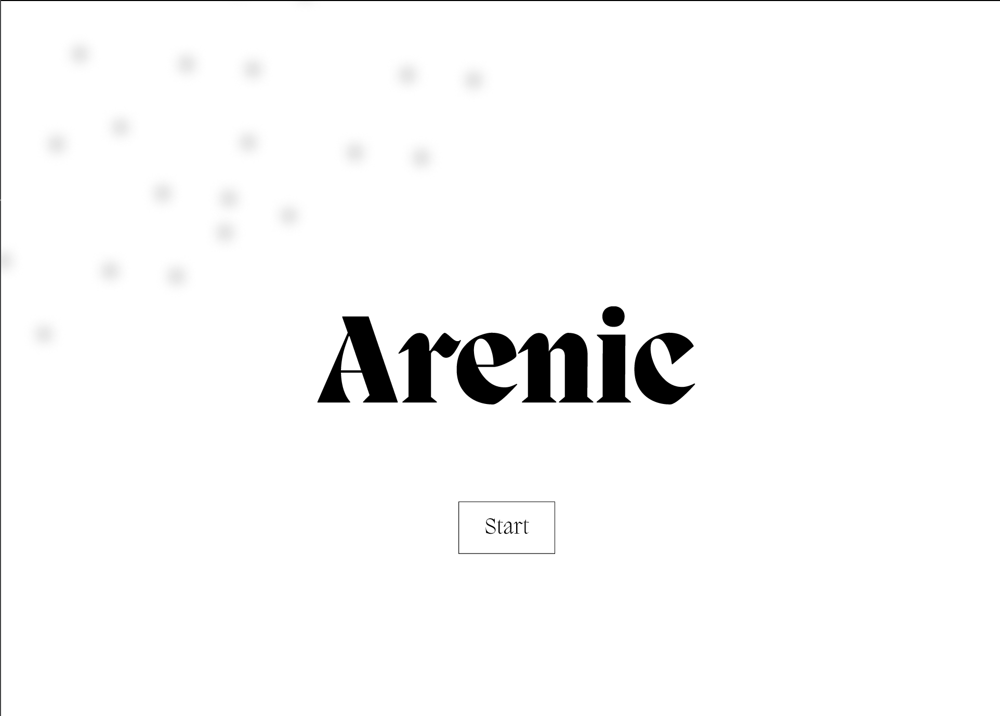

# Arenic

A co-op game inspired by MMoRPG boss battles, Rabbit & Steal, PUBG, and Vampire Surviors.

1. Select your class.
2. Equip gear and go into battle solo or with a party.
3. Pick your level in the arena.
3. Get as far as you can throughout the selected Arena.
4. Last man standing wins the loot.

## Designs:
[Figma](https://www.figma.com/proto/yXxUbjsARweWAWGmTiXPxU/Arenic?page-id=0%3A1&node-id=1-2&viewport=505%2C298%2C0.24&t=U9CjGcjvX0la3GE6-1&scaling=min-zoom&content-scaling=fixed)

 **Title Screen**

**Etymology**:
*From arena (“sand; enclosed area”).*

**Adjective**:
Arenic (comparative more arenic, superlative most arenic)

---
Fonts Used: 
- Migra from [PanagramPanagram](https://pangrampangram.com/products/migra)
- Neue Montreal from [PanagramPanagram](https://pangrampangram.com/products/neue-montreal)

---
## Techstack

- Rust Programming Language
- Bevy Game Framework
- Axum Server
- SurrealDB

---

This is my first game be nice to me!
Linkedin: https://www.linkedin.com/in/morningharwood